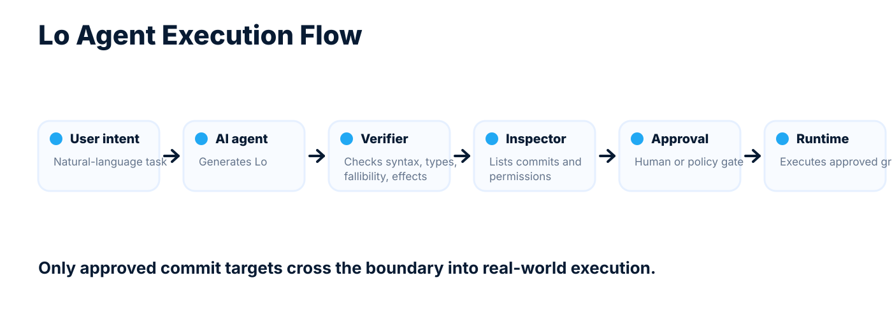

# Lo


**Lo is a typed executable plan language for AI agents.**

Language models are good at proposing workflows, but unsafe as direct executors of arbitrary Python, shell scripts, browser automation, or raw API calls. Lo gives agents a small declarative language for producing action graphs that can be parsed, type-checked, inspected, approved, and executed by a trusted runtime.

Lo is not a replacement for Go, Python, or shell. It is an execution contract between an AI planner, a verifier, and a runtime.

## Status

Lo is currently a **v0.3 language proposal**.

The specification exists before the reference implementation. The next milestone is a verifier capable of parsing and type-checking the conformance examples, followed by a minimal interpreter for file and HTTP workflows.

This repository is public early so the design can be evaluated as an AI-agent execution language. It is not production-ready.

## Core Idea

AI agents should not directly perform irreversible actions. Instead, an agent should emit a typed action graph:



The goal is simple:

```text
Small enough for models to generate reliably.
Strict enough for runtimes to reject bad plans.
Explicit enough for humans to audit.
```

## Why Lo Exists

Python and shell are powerful, but too permissive for direct model-generated execution. An AI-generated Python script can hide arbitrary file access, network calls, subprocess execution, mutation, exception paths, dependency imports, and runtime-only failure modes.

Lo makes these things visible.

A verifier should be able to inspect a Lo program before execution and answer:

- What files may be read?
- What files may be written?
- What HTTP services may be started?
- What operations can fail?
- Which `Error.kind` values can appear?
- Which side effects require `commit`?
- Which adapter boundaries define `onError`?
- Which flows are pure?
- Which flows are effectful?

## Language Discipline

Lo has a small core:

```text
.new(...)       constructs values and adapters
|>              threads values through processors and flows
Match.new(...)  branches as an expression
T!              represents fallible output
Error           represents recoverable failure
commit          activates side effects
onError         handles boundary failure
```

Lo v0.3 intentionally excludes:

- classes and inheritance
- mutable variables
- statement loops
- imperative `if / else`
- anonymous functions and lambdas
- user-visible exceptions
- `try`, `catch`, or `throw`
- implicit nullability
- modules or imports
- async syntax
- concurrency syntax
- shared mutable memory

These omissions are part of the design. The language is meant to be easy for AI agents to generate and easy for verifiers to reject.

## Example: HTTP Handler With Typed Failure

```lo
flow Calculate(request: HTTP.Request) -> HTTP.Response! {
    denominator = Int.new(0)
    result_value = Int.new(10) |> Math.div(denominator)

    return HTTP.Response.Text.new(
        status: Int.new(200),
        body: result_value |> Int.to_string()
    )
}

flow CalculatorHttpError(error: Error) -> HTTP.Response {
    return Match.new(error.kind,
        String.new("Math.DivideByZero"): HTTP.Response.Text.new(
            status: Int.new(400),
            body: String.new("division by zero")
        ),
        _: HTTP.Response.Text.new(
            status: Int.new(500),
            body: String.new("internal error")
        )
    )
}

server = HTTP.Server.new(
    port: Int.new(8080),
    handler: Calculate,
    onError: CalculatorHttpError
)

commit server
```

This program makes several things explicit:

- the HTTP server is constructed before it is activated
- activation happens only through `commit`
- division is fallible because `Math.div(...) -> Int!`
- the handler returns `HTTP.Response!`
- the server requires an `onError` boundary handler
- divide-by-zero is handled as an `Error` value, not as a hidden exception

## Example: File Processing With Self-Handling Flow

```lo
flow IsMatchingScalar(target_scalar: Scalar) -> Bool {
    return Scalar.eq(target_scalar, Scalar.new("a"))
}

flow CountFallback(error: Error) -> Int {
    return Int.new(0)
}

flow CountLetterA(file_path: File.Path) -> Int onError CountFallback {
    file_text = file_path
        |> File.read()
        |> UTF8.String.new()

    match_count = file_text
        |> List.filter(IsMatchingScalar)
        |> List.length()

    return match_count
}
```

This example demonstrates:

- file reads are fallible
- UTF-8 decoding is fallible
- fallible values bubble automatically inside a self-handling flow
- the handler converts failure into a total `Int`
- list processing uses a named pure flow
- no hidden exceptions are visible to the program

## Example: Explicit Side Effects

```lo
flow StatusError(error: Error) -> HTTP.Response {
    return HTTP.Response.Text.new(
        status: Int.new(500),
        body: String.new("status handling failed")
    )
}

flow HandleStatus(status_code: Int, request_data: String) -> HTTP.Response onError StatusError {
    success_log = File.Path.new(String.new("/logs/success.log"))
    error_log = File.Path.new(String.new("/logs/error.log"))

    target_effect = Match.new(status_code,
        Int.new(200): File.append(success_log, request_data),
        _: File.append(error_log, request_data)
    )

    commit target_effect

    return HTTP.Response.Text.new(
        status: status_code,
        body: String.new("Status processed")
    )
}
```

The branch does not perform the write. The branch constructs an effect. The write happens only when the effect is committed.

## Design Principles

1. **Explicit data over hidden behavior**  
   Values, processors, flows, adapters, errors, and commits are separate concepts.

2. **Construction is separate from activation**  
   `.new(...)` constructs values and adapters. `commit` activates side effects and activatable adapters.

3. **Named flows only**  
   Lo v0.3 does not support lambdas or anonymous functions.

4. **Errors are values**  
   Recoverable failures are represented as `Error`, not hidden host-language exceptions.

5. **Fallibility is typed**  
   `T!` means either a successful `T` or an `Error`.

6. **Boundaries are typed**  
   File, HTTP, and future tool adapters are explicit typed boundaries.

7. **Boundary handlers are mandatory**  
   Adapters that invoke user flows must require an `onError` handler.

8. **Side effects are explicit**  
   Effects happen only through evaluated `commit` statements.

9. **The syntax is small**  
   The language favors a compact, canonical surface that models can generate reliably.

10. **The graph is inspectable**  
    A Lo program should be inspectable before execution.

## Intended Use Cases

Lo is designed for AI-agent-generated workflows such as:

- file-processing jobs
- typed tool workflows
- HTTP handlers
- safe automation plans
- data transformation pipelines
- auditable agent actions
- policy-gated execution plans
- constrained internal automation

Example agent task:

```text
Read this uploaded CSV, validate rows, transform accepted records, write accepted rows to one file, write rejected rows to another file, and return a summary.
```

The agent should not execute arbitrary Python. It should generate a Lo program that can be checked, inspected, approved, and executed.

## Planned CLI

The reference implementation is expected to expose commands like:

```bash
lo parse examples/list_sum.lo
lo check examples/list_sum.lo
lo inspect examples/agent_file_workflow.lo
lo run examples/list_sum.lo
lo serve examples/http_division.lo
```

The most important command is:

```bash
lo inspect program.lo
```

Expected inspection output should include:

```text
Pure flows:
- ValidateRow
- RenderCsv

Fallible operations:
- File.read -> File.ReadFailed
- UTF8.String.new -> UTF8.InvalidBytes
- Map.get -> Map.MissingKey

Commit targets:
- File.write /output/accepted.csv
- File.write /output/rejected.csv

Adapter boundaries:
- HTTP.Server onError: HttpError

Required permissions:
- read: /input/users.csv
- write: /output/accepted.csv
- write: /output/rejected.csv
```

## Repository Layout

```text
lo/
  README.md
  specification.md
  ISSUES.md
  assets/
    lo-logo-horizontal.svg
    agent-execution-flow.svg
    social-preview.png
  examples/
    list_sum.lo
    count_letter.lo
    http_division.lo
    agent_file_workflow.lo
  docs/
    agent-language-positioning.md
    verifier-model.md
  LICENSE
```

## Implementation Roadmap

### Milestone 1: Verifier MVP

Build a verifier that can:

- parse `.lo` files
- validate the grammar
- resolve built-in constructors and processors
- type-check bindings and flows
- reject unresolved fallible values in total flows
- enforce mandatory `onError` handlers for adapter boundaries
- identify all `commit` targets
- report possible side effects
- report possible `Error.kind` values

Target command:

```bash
lo check examples/list_sum.lo
```

### Milestone 2: Inspection Report

Build static inspection for agent-generated programs.

Target command:

```bash
lo inspect examples/agent_file_workflow.lo
```

The inspection report should expose:

- pure graph nodes
- fallible graph nodes
- effectful flows
- commit targets
- adapter boundaries
- required permissions
- possible recoverable errors

### Milestone 3: Minimal Interpreter

Build an interpreter for pure expressions and file workflows.

Initial support:

- `String`
- `Int`
- `Bool`
- `List`
- `Record`
- `Match.new`
- `Math`
- `List.filter`
- `List.map`
- `File.read`
- `UTF8.String.new`
- `Error`
- `T!` bubbling
- self-handling flows

Target command:

```bash
lo run examples/count_letter.lo
```

### Milestone 4: Commit and HTTP

Add side-effect activation and HTTP serving.

Initial support:

- `Effect`
- `File.append`
- `File.write`
- `commit`
- `HTTP.Server.new`
- `HTTP.Request`
- `HTTP.Response`
- adapter-level `onError`

Target command:

```bash
lo serve examples/http_division.lo
```

## Agent Profile

Lo should support a canonical agent-generation profile.

The agent profile should require:

- canonical formatting
- no alternate equivalent syntax
- explicit adapter construction
- explicit `commit`
- no hidden capabilities
- no implicit environment access
- static listing of all side effects
- static listing of fallible operations
- mandatory boundary `onError`
- verifier success before execution

The agent profile is the practical product surface:

```text
LLMs generate Lo Agent Profile.
Verifiers check Lo Core.
Runtimes execute approved action graphs.
```

## Security Model

Lo does not make AI agents safe by itself. Instead, it gives a runtime a smaller and more inspectable execution surface.

A secure Lo runtime should:

- deny execution unless parsing succeeds
- deny execution unless type checking succeeds
- deny execution unless all required permissions are approved
- deny execution of unknown adapters
- deny execution of unknown processors
- sandbox adapter implementations
- treat `commit` as the only side-effect activation point
- log all commit activations
- preserve structured error traces

## Current Specification

The current language version is:

```text
Lo v0.3
```

The v0.3 specification defines:

- values
- processors
- flows
- adapters
- effects
- `commit`
- fallible types
- `Error`
- `Null`
- records
- maps
- lists
- ranges
- `Match.new`
- pipe syntax
- flow purity
- adapter boundary handlers
- HTTP semantics
- grammar
- minimal standard library
- conformance matrix

See:

- [specification.md](specification.md)
- [ISSUES.md](ISSUES.md)

## Non-Goals

Lo v0.3 is not trying to be:

- a general-purpose programming language
- a Python replacement
- a shell replacement
- a workflow engine with every possible integration
- a visual programming system
- a distributed compute framework
- an ownership-language experiment
- a concurrency model
- a package ecosystem

The goal is:

```text
Make AI-generated action plans typed, inspectable, and executable by a trusted runtime.
```

## Contributing

This project is currently in proposal and verifier-design stage.

Useful contributions include:

- parser implementation
- type checker implementation
- conformance tests
- example Lo programs
- verifier report design
- adapter permission model design
- critique of the core semantics
- simplification proposals

Less useful contributions at this stage:

- syntax bikeshedding without implementation impact
- adding large language features
- adding general-purpose programming constructs
- adding module systems or package management
- adding async or concurrency syntax

## License

Apache-2.0 is recommended for this project.
